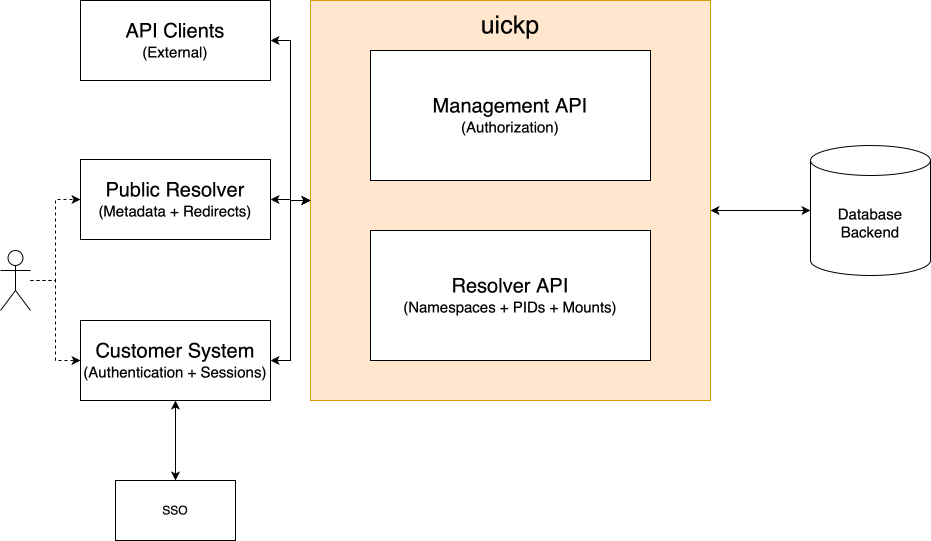

# PID Resolver Specification

> [!WARNING]
> See [the main README](../README.md) for a generic introduction to what a PID is and why it is needed.

> [!WARNING]
> This document is a work in progress and not yet completed.

We propose that a PID system consists of the following components, also seen in the sketch above:

- An internal __Resolver API__ and associated database backend.
  It is the central system that handles issuing and storing PIDs and associated metadata.
- A __Management API__, which handles authentication and authorization.
- A public __Read-Only Frontend__ that can display each PID and respond to clients with an HTTP redirect response for specific PIDs.
- A __Customer Frontend__, which allows customers to manage their PIDs, and optionally adds SSO support.
- Further __Internal Clients__, which may connect directly to the resolver API.

This folder provides a specification for the Resolver and Management API, although there is no strict distinction between them.

## Credits & LICENSE

This folder only provides a technical documentation and specification for the Quickpid Resolver and Management API.
These were written up by me (Tom Wiesing).

The system as a whole, and the Resolver API in particular, were designed collaboratively with input, feedback, and discussion from (in alphabetical order):
<!-- spellchecker:words Dominik Schmid Amann Walther Bidisha Borgohain -->

- Kai Amann
- Bidisha Borgohain
- Mona Dietrich
- Anne-Christine Plank
- Dominik Schmid
- Marcus Walther

Content in this directory is available under either of the following two licenses:

- [Creative Commons Attribution-ShareAlike 4.0 International](https://creativecommons.org/licenses/by-sa/4.0/), see [the LICENSE file](./LICENSE).
- [GNU Affero General Public License 3.0](https://www.gnu.org/licenses/agpl-3.0.en.html) (to match the rest of this repository) see [the top-level LICENSE file](../LICENSE).

## The API Specification

The API specification takes the shape of an [OpenAPI 3.0.0](https://spec.openapis.org/oas/v3.0.0.html) specification in [`openapi.yaml`](./openapi.yaml).
Information in this README is non-normative, and provided for convenience only.

The API is designed with a lot of verbosity in mind.
In particular, all routes always require explicit parameters and in most cases are not defaulted automatically.
Implementations should also validate objects passed, and return appropriate error codes when they do not match.

The API roughly splits into a `Resolver API` and a `Management API`.
The Resolver API is responsible for creating PIDs, whereas the Management API is responsible for authentication and authorization. 

In principle, the API can be run in one of two modes:

- `Anonymous Mode`:
  The Management API is disabled, and no authentication for any API routes is required.
  This corresponds to just running the Resolver API in the architecture sketch above.   
- `Authenticated Mode`:
  Both Management and Resolver API are active.
  Users need to authenticate to access specific resolver routes.

Continuing, this document first discusses the pure Resolver API, and then moves on to talking about the Management API.

### Resolver API

The Resolver API talks about two kinds of objects:
- **Namespaces**, which hold a set of Resources, and
- **Resources**, which represent a PID along with the associated metadata.

#### Creation, Updates & Deletion

Namespaces are intended to hold independent sets of PIDs.
The API enables creating a new namespace.
Each namespace itself has an identifier generated by the API.
When creating a namespace, the format for PIDs within the namespace must be set.
Additionally, a tag for the namespace can be provided (see below).
Once a namespace has been created, it cannot be changed, as that would possibly effect all Resources within.

Only a single resource can be created at a time.

A Resource can be created via the API.
It is then issued a new unique PID in the format specified within its' namespace.
During creation, three kinds of metadata must be provided:
- A URL that the resource points to;
- Optional Metadata (either an opaque string or `null`); and
- A Tag (see below).

It is possible to create a single resource at a time, or create multiple resources at the same time.
When bulk creating resources, they must live in the same namespace.

The metadata for a Resource can be updated, but the underlying PID cannot be changed.
Resources cannot be deleted, however they contain a deleted flag enabling soft deletion.
From the perspective of the API this flag is just like any other flag.

Namespaces hold a so-called tag: a single string used for filtering, with no other effect.
A namespace tag cannot be updated after creation.

Resources hold one or more tags, also used for filtering.
Exactly one tag is expressed in JSON as the singular `tag` field; two or more tags use the `tags` array (at least two items).
Empty tag lists are not allowed, and mixing `tag` with `tags` is invalid.
Resource tags can be updated.

#### Listing and Retrieval

Given the ID of a namespace the API can return information about the namespace (`GET /resolver/namespaces/{namespace}`; same JSON shape as each entry when listing namespaces).
Given the PID of a resource along with a namespace, the API can return the current metadata for the associated resource.

The API also has functionalities for listing all namespaces, and all resources inside a namespace.
A dedicated endpoint returns the total number of resources (issued PIDs) across all namespaces, including soft-deleted resources (`GET /resolver/resources/count`).
List responses are always paginated and take appropriate query parameters.
Objects are always returned in ascending order by ID.

Namespaces can be filtered by their tag (exact match).
Resources can be filtered by tag membership (the resource includes the given tag) and by deletion status.

TODO: document namespace mounts (`/resolver/mounts/{base_uri}`).

### Management API

(to be documented)

## Test cases

Test cases can be found in the [`tests`](./tests/) directory.
Each test case is held within a single JSON file.

The structure of the test cases is rather self-explanatory -- each consists of a set of expected requests and expected responses.
The precise format corresponds to the [the flow struct](../internal/servertest/apitest.go) in the `internal/servertest` package, but should be reusable by other implementations.

Each file is a single JSON object of the following structure.
Fields may be omitted in case they are not relevant for the test case.

- **`name`** (string): identifier for the test case.
- **`comment`** (string, optional): human-readable note.
- **`steps`** (array): ordered steps.
  Each step corresponds to a single http request / response flow.
  Each is an object with:
  - **`name`** (string): step identifier.
  - **`config`** (object, optional), representing configuration and expected "randomness" values to be used by the server.
    Each option is optional.
    - **`namespaceIDs`**, **`pids`**, **`apiKeyIDs`**, and **`apiKeys`** (string arrays): IDs and secrets the server should generate in order when creating namespaces, resources, or issuing API keys.
    - **`now`** (RFC3339 timestamp string): The current time for the request.
    - **`infoEnabled`** (boolean): If the general endpoint `/resolver` should be enabled or not.
    - **`anonymous`** (boolean, optional): If anonymous resolver mode should be enabled for this step. Default is false.
    - **`ensureRootUser`** (boolean): If set, runs the same root-user bootstrap as server startup before this step (empty store only). Pair with **`apiKeyIDs`**, **`apiKeys`**, and **`now`** so the issued root key is deterministic.
  - **`limits`** (object, optional): Determines limits to be set by the server.
    Each field is numeric, and an omitted field implies no limit should be applied, or a suitable default may be used.
    - **`MaxBodyBytes`**
    - **`DefaultPageLimit`**
    - **`MaxPageLimit`**
    - **`MaxBatchItems`**, 
    - **`MaxAutocompleteUsers`**
    - **`MaxNamespaceIDAttempts`**
    - **`MaxPIDAttempts`**
  - **`request`** (object):
    An object representing the request to send to the server.
    - **`method`** and **`path`** (strings);
    - optional **`headers`**, an array of two-element arrays **`[name, value]`** (strings).
      Use an `Authorization` header with `Bearer <api-key>` when the request must be authenticated.
      Keys in auth tests are explicit in each step's **`headers`**, or set up via **`ensureRootUser`** and subsequent HTTP requests (for example `POST /user/` and `POST /user/key`).
    - optional **`body`**, a **JSON string** whose UTF-8 text is the raw HTTP request body (valid JSON, invalid JSON, or other bytes as the case requires).
      If there is no body, **`body`** is omitted.
  - **`response`** (object, optional):
    An object representing the expected response from the server.
    - **`code`** (HTTP status integer); optional
    - **`headers`** (same shape as the request) with the following difference:
    - optional **`body`**, a JSON **value** (typically an object) representing the expected response body.
    Comparison is JSON-semantic (e.g. object key order ignored).
